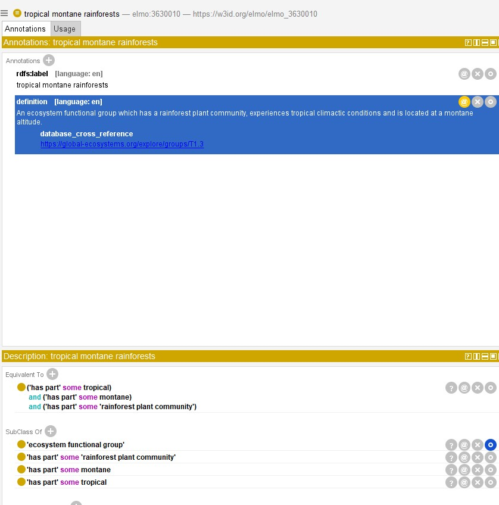

# What is an ontology? (Explain it like I'm 5!)

An ontology is a list of terms and definitions that are organized by their relationships. The main relationship in ontology world is `subclass of`. Every term in an ontology is a subclass of some other term, all the way up to "thing" which is the root.

Let's look at an example of a simple bicycle ontology:


This example needs some definitions. Let's start with `bicycle`, for which we can consult our friend [Merriam-Webster](https://www.merriam-webster.com/dictionary/bicycle):

- `bicycle` def. A vehicle which has two wheels, handlebars for steering, a saddle seat, and pedals by which it is propelled.

> **Further reading on ontology definitions:** [OntoTip: Write simple, concise, clear, operational textual definitions](https://douroucouli.wordpress.com/2019/07/08/ontotip-write-simple-concise-clear-operational-textual-definitions/)

That's a pretty straightforward definition, which is what you want in an ontology. We are trying to describe the fundamental characteristics of a `bicycle`. Sure, lots of bicycles have bells, but if they do not, are they still a `bicycle`? Yes!

Now we could go down a philosophical rabbit hole here (if you take off a wheel, is it still a `bicycle`? Kind of.), but that's beyond this tutorial.

### So what the heck is a subclass?

In our (very simple) ontology, `bicycle` has two subclasses - `geared bicycle` and `fixed-gear bicycle`. Let's establish some definitions:

- `geared bicycle` def. A bicycle which includes different sized gears as part of the drive-train and some mechanism to change gears.
- `fixed-gear bicycle` def. A bicycle which includes fixed-size gears as part of the drive-train.

Here is the subclass magic: We do not need to repeat definitions. We know what a bicycle is already, so we can just add to that definition and get more specific. This is called an "Aristotelian definition." 

You might see this expressed in the form: `A is a B that Cs`.

In this case:

* A: `geared bicycle` is a
* B: `bicycle` that
* C: has changable, different-sized gears.


A `geared bicycle` is a `bicycle` that has changable, different-sized gears. 

## How do I use an ontology?

Below we break down three major use-cases for ontologies, and specifically for ELMO. The first deals with ontology entries as points of data, the second addresses how ontologies can describe data, and the third discusses ontologies as knowledge bases themselves.

### Ontology as data

Ontology terms can be used as part of your dataset. Here an ontology is comparable to a controlled vocabulary - a restricted set of terms. There are, however, some important differences.

Let's continue with our bicycle example. Pretend you own a bicycle store and you have a record of sales for the past 10 years. For 2 of the 10 years, staff recorded the type of bicycle sold. Here's a sample of the data:

|Bicycle|Sell date|Type|Type URI|Type CURIE|
|-------|---------|----|--------|----------|
|Belvedere|05-20-2022|City bicycle|https://w3id.org/bikes/3|bike:3|
|Gravel express|05-21-2022|Geared bicycle|https://w3id.org/bikes/4|bike:4|
|Roadtrip|05-22-2022|Road bicycle|https://w3id.org/bikes/5|bike:5|

This ontology-aware bicycle store owner wisely used terms from the ontology! But what is that column with URIs? 

One important feature of an ontology is that each term has a unique URI (commonly called URL) that should permanently point to that term's home on the web. The links in our example won't work, but here's one that does: http://purl.obolibrary.org/obo/ENVO_01000430. 

This is part of the power of ontologies. You can give that dataset to anyone and they can follow the links to find out the meaning of the term. Previously, you had to rely on the author supplying detailed metadata to explain what each entry means.

#### Got it - so what is the 'Type CURIE' column?

A CURIE (**C**ompact **U**niform **R**esource **I**d**e**ntifier) is an abbreviated form of the URI. 

For example: bike:5

There are certain technologies ([RDF](https://en.wikipedia.org/wiki/Resource_Description_Framework), [SPARQL](https://en.wikipedia.org/wiki/SPARQL)) that are built to work with CURIEs. In those formats, the prefix (e.g. bike:; also called a namespace) will be defined somewhere in the document. Like this:

`@prefix bike: <https://w3id.org/bikes/>`

This is basically saying: "Whenever you see "bike:", replace it with "https://w3id.org/bikes/". So that `bike:4` becomes `https://w3id.org/bikes/4`.

> More information on CURIEs: [What's a CURIE, and Why You Should be Using Them](https://cthoyt.com/2021/09/14/curies.html)

#### So how do I do this?

Let's look at a real example:

&nbsp;&nbsp;&nbsp;*You are conducting a systematic literature review and extracting the ecosystem type that each study occurs in. This is a messy task: some authors will write with little detail and just use the word "forest" and others may lean on different typologies.*

Or you could refer to terms that exist in ELMO as a subclass of [ecosystem functional group](https://w3id.org/elmo/elmo_3630003) (ELMO:3630003):

- [tropical lowland rainforests](https://w3id.org/elmo/elmo_3630004) (ELMO:3630003)
- [tropical montane rainforests](https://w3id.org/elmo/elmo_3630010) (ELMO:3630010)

### Ontology as metadata

Metadata files describe what datasets contain. Metadata files can be as simple as a text file that contains some background about the dataset, or complex XML files that can be interpreted by machines. Ontologies can be useful no matter which form your metadata takes.

The key is to use terms and provide their URI where relevant. For example: Let's pretend you did vegetation surveys in an area that has all the qualities of a [tropical lowland rainforests](https://w3id.org/elmo/elmo_3630004) (ELMO:3630003). You could:

- Write "We conducted plant surveys in a tropical lowland rainforest (https://w3id.org/elmo/elmo_3630004)" in your `README.txt` file.
- **or** Create an XML file compliant with the [Ecological Metadata Language (EML)](https://eml.ecoinformatics.org/) that includes [semantic annotation](https://eml.ecoinformatics.org/semantic-annotation-primer):

```
    <annotation>
        <propertyURI label="is about">http://purl.obolibrary.org/obo/IAO_0000136</propertyURI>
        <valueURI label="tropical lowland rainforests">https://w3id.org/elmo/elmo_3630004</valueURI>
    </annotation>
```

There are a few advantages to using ontologies in metadata:

- A consistent, clear meaning is embedded in the link.
- It can make your data more machine-interpretable and provide better indexing.
- If terms are updated or replaced (deprecated), that will be reflected at the permalink.
- Your dataset will be linked with other datasets that were collected in tropical lowland rainforests.
- It is less work than writing out the whole ecosystem description.

### Ontology as knowledge base

(*This section moves a bit beyond the basics of ontology usage, so you might want to skip it if you are happy with the above two uses!*)

The third and final basic use of an ontology is as a knowledge base in and of itself. Ontologies - especially domain ontologies - can tell you things about the relationships between things in a particular field of knowledge. 

We haven't talked yet about a core concept in ontology land called 'axioms.' In addition to the plain-language definition of a term, it can also have logical statements that relate it to other terms in the ontology. Let's look at an example:



Above you will see a screenshot from the ontology editor [Protégé](https://protege.stanford.edu/) that shows types of properties for our term: annotations (top) and axioms (bottom).

There are a few annotations that should be familiar to you by now. The `label` is the plain language name of the term. The `definition` is its definition. The annotation property `database_cross_reference` is a link to an external database describing the term (in this case the IUCN's page for this ecosystem functional group).

The bottom box contains axioms that relate this term to others. There are three listed under `equivalent to`, which means that this term is synonymous with this big long statement:

```
('has part' some tropical) and ('has part' some montane) and ('has part' some 'rainforest plant community')
```

What this means is that `tropical montane rainforests` experience tropical climactic conditions ([tropical](http://purl.obolibrary.org/obo/ENVO_01000204) (`ENVO:01000204`) which is a subclass of [environmental condition](http://purl.obolibrary.org/obo/ENVO_01000203)), are in montane environments ([montane](http://purl.obolibrary.org/obo/ENVO_01000342) which is a subclass of [altitudinal condition](http://purl.obolibrary.org/obo/ENVO_01000343)) and have a [rainforest plant community](https://w3id.org/elmo/elmo_3630002). 

That's a whole lot more information than is contained in the label itself. Remember, computers are not great at interpreting text, but they can interpret logical relationships like axioms.

# Where next?

Once you get some experience using an ontology, you might feel the need to contribute. Maybe there's a term you need that is not contained in any ontology, or you find an inaccurate definition. Move on to our [advanced user](advanceduser.md) documentation to explore the next steps in your ontology journey.


Other resources:

- [OBO Academy Tutorial: From Tables to Linked Data](https://oboacademy.github.io/obook/tutorial/linking-data/)
