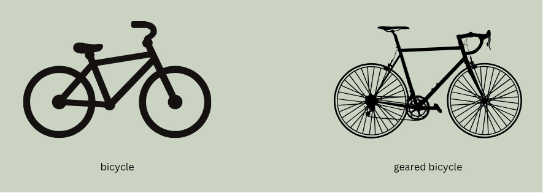

# Basic user

# What is an ontology?

## Explain it like I'm 5 years old (ELI5)
An ontology is a list of terms and definitions that are organized by their relationships. The main relationship in ontology world is `subclass of`. Every term in an ontology is a subclass of some other term, all the way up to "thing" which is the root.

Let's look at an example of a simple bicycle ontology:

This example needs some definitions. Let's start with `bicycle`, for which we can consult our friend [Merriam-Webster](https://www.merriam-webster.com/dictionary/bicycle):
- `bicycle` def. A vehicle which has two wheels, handlebars for steering, a saddle seat, and pedals by which it is propelled.

> **Further reading on ontology definitions:** [OntoTip: Write simple, concise, clear, operational textual definitions](https://douroucouli.wordpress.com/2019/07/08/ontotip-write-simple-concise-clear-operational-textual-definitions/)

That's a pretty straightforward definition, which is what you want in an ontology. We are trying to describe the fundamental characteristics of a `bicycle`. Sure, lots of bicycles have bells, but if they do not, are they still a `bicycle`? Yes!

Now we could go down a philosophical rabbit hole here (if you take off a wheel, is it still a `bicycle`? Kind of.), but that's beyond this tutorial.

### So what the heck is a subclass?

In our (very simple) ontology, `bicycle` has two subclasses - `geared bicycle` and `fixed-gear bicycle`. Let's establish some definitions:
- `geared bicycle` def. A bicycle which includes different sized gears as part of the drive-train and some mechanism to change gears.
- `fixed-gear bicycle` def. A bicycle which includes fixed-size gears as part of the drive-train.

Here is the subclass magic: We do not need to repeat definitions. We know what a bicycle is already, so we can just add to that definition and get more specific. This is called an "Aristotelian definition." 

You might see this expressed in the form: `A is a B that Cs`.

In this case:
- A: `geared bicycle` is a
- B: `bicycle` that
- C: has changable, different-sized gears.

A `geared bicycle` is a `bicycle` that has changable, different-sized gears. 

## How do I use an ontology?

Below we break down three major use-cases for ontologies, and specifically for ELMO. The first deals with ontology entries as points of data, the second addresses how ontologies can describe data, and the third discusses ontologies as knowledge bases themselves.

### Ontology as data

Ontology terms can be used as part of your dataset. Here an ontology is comparable to a controlled vocabulary - a restricted set of terms. There are, however, some important differences.

Let's continue with our bicycle example. Pretend you own a bicycle store and you have a record of sales for the past 10 years. For 2 of the 10 years, staff recorded the type of bicycle sold. Here's a sample of the data:

|Bicycle|Sell date|Type|Type URI|Type CURIE|
|-------|---------|----|--------|----------|
|Belvedere|05-20-2022|City bicycle|https://w3id.org/bikes/3|bike:3|
|Gravel express|05-21-2022|Geared bicycle|https://w3id.org/bikes/4|bike:4|
|Roadtrip|05-22-2022|Road bicycle|https://w3id.org/bikes/5|bike:5|

This ontology-aware bicycle store owner wisely used terms from the ontology! But what is that column with URIs? 

One important feature of an ontology is that each term has a unique URI (commonly called URL) that should permanently point to that term's home on the web. The links in our example won't work, but here's one that does: http://purl.obolibrary.org/obo/ENVO_01000430. 

This is part of the power of ontologies. You can hand that dataset to anyone and they can follow the links to find out the meaning of the term. Previously, you had to rely on the author supplying detailed metadata to explain what each entry means.

#### Got it - so what is the 'Type CURIE' column?

A CURIE (**C**ompact **U**niform **R**esource **I**d**e**ntifier) is an abbreviated form of the URI. 

For example:
&nbsp;&nbsp;&nbsp;&nbsp;&nbsp;bike:5

There are certain technologies ([RDF](https://en.wikipedia.org/wiki/Resource_Description_Framework), [SPARQL](https://en.wikipedia.org/wiki/SPARQL)) that are built to work with CURIEs. In those formats, the prefix (e.g. bike:; also called a namespace) will be defined somewhere in the document. Like this:

`@prefix bike: <https://w3id.org/bikes/>`

This is basically saying: "Whenever you see "bike:", replace it with "https://w3id.org/bikes/". So that `bike:4` becomes `https://w3id.org/bikes/4`.

> More information on CURIEs: [What's a CURIE, and Why You Should be Using Them](https://cthoyt.com/2021/09/14/curies.html)

#### So how do I do this?

Let's look at a real example:

> You are conducting a systematic literature review and extracting the ecosystem type that each study occurs in. This is a messy task: some authors will write "forest" and others "tropical lowland rainforest" and others "tropical dry forest." 

You could split up the columns and have a "coarse ecosystem type" (e.g. forest) and a "fine ecosystem type" (e.g. boreal forest). Then you could describe what you mean by that in the metadata.

Or you could refer to terms that exist in ELMO:
- 

### Ontology as metadata

### Ontology as knowledge base

Other basic resources:
- [OBO Academy Tutorial: From Tables to Linked Data](https://oboacademy.github.io/obook/tutorial/linking-data/)
