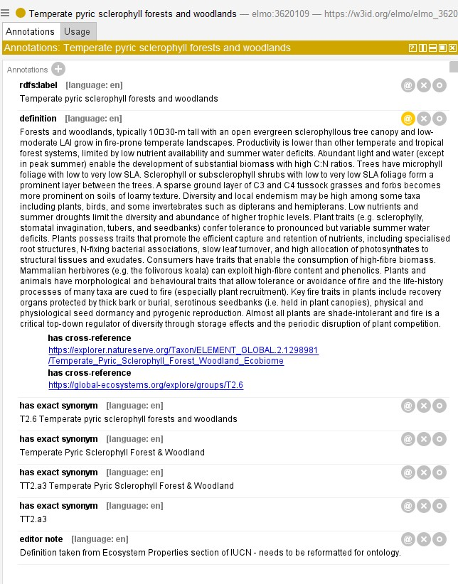

# Ecosystem types in ELMO
## Overview
Ecosystems are complex assemblies of organisms, landscape features and climactic conditions. Classification schemes have been developed and adopted where there is a need to ensure that people are talking about the same thing. For instance, if someone says they restored an ecosystem to be a **Temperate pyric humid forest** (`ELMO:3620108`), findings may or may not hold in a **Temperate pyric sclerophyll forest** (`ELMO:3620109`). Many nations, states or provinces will have their own ecosystem classification systems which may or may not align with major international systems.

In short: It's a bit of a mess right now.

For ELMO, we have incorporated two major international classification schemes: The IUCN's [Global Ecosystem Typology 2.0](https://global-ecosystems.org/) (herein GET) and NatureServe's [International Vegetation Classification](https://www.natureserve.org/projects/international-vegetation-classification) (herein IVC). The two systems are complimentary and have a co-authored crosswalk between them ([Faber-Langendoen et al. 2025](https://doi.org/10.1002/ecs2.70237)). 

The ecosystem types in ELMO are transliterated from GET and IVC. That means that the names are exactly as they appear in the classification schemes, and the definitions are pasted exactly from the classification scheme where available. This is an awkward fit in an ontology - it violates a bunch of well-established conventions in ontology design. This choice was made in large part to respect the consultative work done by the IUCN and NatureServe. Lacking the resources to do extensive consultation, it did not seem sensible to change any of the work already done. However, as a result, the ontology may not look like other ontologies.

## About each entry

### Hierarchies

The GET and IVC have slightly different taxonomic hierarchies. GET organizes its ecosystem functional groups under biomes (e.g. **Temperate-boreal forests and woodlands biome** (`elmo:3620208`)). The IVC also organizes its classification schemes with biomes, but introduces a layer between the biome and ecosystem type called a subbiome (e.g. **Boreal Forest & Woodland Subbiome**(`elmo:3620244`)). Another subtle difference between the two categories is that GET ecosystems tend to be plural, while IVC is singular. GET uses sentence case and only capitalizes the first letter, while IVC uses title case.

### GET & IVC entries

The above example shows an ecosystem type that is exactly synonymous between the GET and IVC. In this case, NatureServe defers to the GET for the definition. The GET definition is included here, as well as cross-reference URLs for both the GET and IVC versions of this ecosystem type. We have also included synonyms in the GET that use the shortcode (T2.6) and synonyms in the IVC that use their shortcode (TT2.a3). Thus the single permanent identifier `elmo:3620109` can stand for the ecosystem type in both typologies.

## Next steps
* **Ontologize the ecosystem definitions.** Each ecosystem type should have a clear logical definition, and a more parsimonious textual definition. This means figuring out what the differentia are (e.g. leaf form, climate, altitude) and revising the terms accordingly. Fidelity with the original taxonomies should be maintained, but it may be necessary to split or change terms. See Chris Mungall's blog posts on [definitions](https://douroucouli.wordpress.com/2019/07/08/ontotip-write-simple-concise-clear-operational-textual-definitions/) and [normalization](https://douroucouli.wordpress.com/2019/06/29/ontotip-learn-the-rector-normalization-technique/) for guidance on how to accomplish this.
* **Add more classification systems.** The Braun-Blanquet classification system is one that is used in Europe and we have not yet incorporated it into ELMO. There is a paper bridging the IVC and Braun-Blanquet: [Willner & Faber-Langendoen 2021](https://www.researchgate.net/profile/Wolfgang-Willner/publication/357001672_Braun-Blanquet_meets_EcoVeg_a_formation_and_division_level_classification_of_European_phytosociological_units/links/61b794151d88475981e89c56/Braun-Blanquet-meets-EcoVeg-a-formation-and-division-level-classification-of-European-phytosociological-units.pdf).
