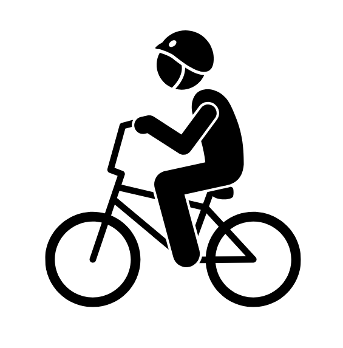
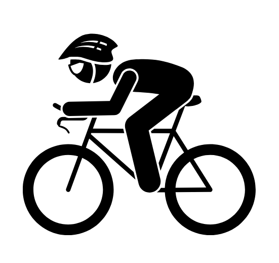
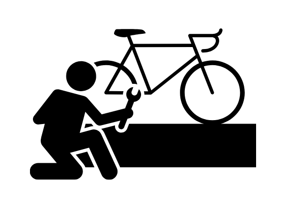

# ELMO Ontology Documentation

Welcome to the ELMO documentation! ELMO is an application ontology for the Ecolink Model - a schema for knowledge graphs that describe environmental processes. This documentation is divided into three main levels depending on your level of use. Here we use a bicycle as a metaphor for an ontology:

- **Basic user:** You use a bicycle as a tool to get around and have little interest beyond that.
- **Advanced user:** You are a bicycle racer and have a keen interest in all things bicycle, but still focus on using it as a way to get around.
- **Mechanic:** You like to get into the gears and grease by making bicycles work better for other people (and yourself, too).

Here's a breakdown of what each user type might be interested in doing with the ontology:

## Basic user
 
You are:
- New to ontologies in general.
- Interested in using terms from the ontology to annotate your data.
- Have little knowledge or interest in programming.

## Advanced user
 
You are:
- Experienced with the use of ontologies.
- Primarily interested in using the ontology, but also open to contributing.
- Have little knowledge or interest in programming.

## Mechanic
 
You are:
- Experienced with the use of ontologies.
- Interested in using and stewarding the ontology.
- Are not scared of a little code!